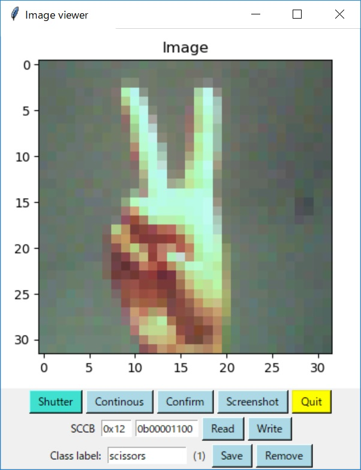
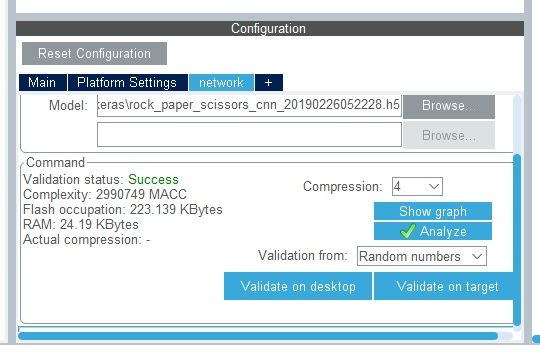

# image-features


(Work in progress)

## Motivation

I am just interested in computer vision at lower resolutions (32x32 or 128x128) for edge AI.

## Limited resources

- Since the RAM size of STM32F4 Discovery board is very limited (around 100KBytes), I mainly handle 32x32 resolution images in this project.
- Although deep learning is quite a heavy task, it is possible to run deep learing on 32x32 resolution images with a limited number of classes on my PC.

## Architecture


```
                 STM32L4 Discovery
                ...................
                :                 :
 [OV7670]----->[DCMI]        [UASRT]------>[Python program on my PC]
                :                 :
                ...................
```

## CAD

- [Schematic (KiCad)](https://github.com/araobp/image-features/blob/master/kicad/ov7670_expansion_board.pdf)
- [Pedestal for the device (FreeCAD)](./freecad).

## Code

- [Firmware on STM32](./stm32)
- [Image viewer (matplotlib/Tkinter)](./python)

## Keras model (Jupyter Notebook)

I captured a hundred of images for each class (rock, paper, scissors) by using the viewer, then trained CNN with the data: [Rock-paper-scissors](./keras/rock_paper_scissors_cnn.ipynb).

## X-CUBE-AI use cases

### Rock-paper-scissors



I made X-CUBE-AI/CubeMX to generate image classification code based on the Keras model. The code could classify "rock", "paper" and "scissors".

```
--- Inference ---
 PAPER         1%
 ROCK         26%
 SCISSORS     71%

--- Inference ---
 PAPER         0%
 ROCK         53%
 SCISSORS     46%

--- Inference ---
 PAPER        54%
 ROCK         13%
 SCISSORS     31%
       :
```

## My related works

Sensors used for adge AI:
- 9-axis sensor (MEMS)
- Mic sensor (MEMS)
- Infrared array sensor
- Image sensor

### Projects (sort of edge AI things)

- [Camera (OV7670 CMOS image sensor)](https://github.com/araobp/stm32-mcu/blob/master/STM32F4-Discovery/Camera)
- [AI-enabled rock-scissor-papers (infrared array sensor)](https://github.com/araobp/stm32-mcu/tree/master/NUCLEO-F401RE/AI)
- [Acoustic features (Mic sensor)](https://github.com/araobp/acoustic-features)
- [Wireless network of infrared array sensors (infrared array sensor)](https://github.com/araobp/pic16f1-mcu/blob/master/TWELITE.md)
- [Motion logger with PIC16F18326, MPU9255, A1324LUA-T and EEPROM (9-axis sensor)](https://github.com/araobp/pic16f1-mcu/blob/master/MOTION_LOGGER.md)
- [My original DCT Type-II implementation on CMSIS-DSP](https://github.com/araobp/stm32-mcu/tree/master/NUCLEO-F401RE/DCT)

### Demo (YouTube)

- [AI-enabled rock-paper-scissors](https://www.youtube.com/watch?v=d6OYSllaVEs)
- [Musical instrument recognition](https://www.youtube.com/watch?v=wbkjt2Bl5TY)
